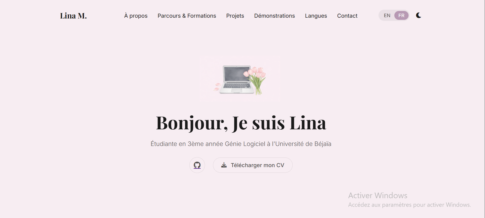

#  Portfolio — Lina Maouche
> **Étudiante en Génie Logiciel (ING3) | Université de Béjaïa**

Bienvenue sur le dépôt de mon portfolio personnel. Ce projet est une vitrine interactive de mon parcours académique et technique, conçue pour présenter mes compétences en développement, mes projets phares et mes certifications.

<p align="center">
  <a href="https://github.com/linaMCH">
    
  </a>
  <br>
  <em>Cliquez sur l'image pour accéder au site en direct</em>
</p>

---

## Architecture & Stack Technique
Ce portfolio a été développé avec une approche **"Clean Code"** et une attention particulière portée à l'expérience utilisateur (UX) :

* **Frontend :** HTML5 sémantique, CSS3 (Flexbox & Grid), JavaScript.
* **UI/UX :** * Design **Responsive** (optimisé pour mobile, tablette et desktop).
    * Système de **Thème Dynamique** (Dark/Light Mode).
    * Architecture bilingue (Français/Anglais).
* **Gestion des Erreurs :** Pages d'erreurs (404) personnalisées pour garantir une navigation fluide et cohérente avec le design global.
* **Gestion des États :** Architecture multi-pages incluant des vues dédiées pour la maintenance (`maintenance.html`) et les états d'attente (`attente.html`), offrant une expérience utilisateur fluide même lors des mises à jour.
* **Performance :** Optimisation du rendu pour l'exportation PDF via les `@media print`.
* **Déploiement :** GitHub Pages avec intégration continue.

---

## Structure du Projet

L'architecture du dépôt respecte une séparation stricte entre les ressources statiques, la documentation académique et la gestion de l'expérience utilisateur :

```text
.
├── 📂 assets/           # asset visuel du projet
├── 📂 documents/        # mon CV en pdf
├── 📂 images/           # Captures d'écrans 
├── 📂 rapports/         # Documentation technique et dossiers de conception
├── 📂 temporaires/       # Pages de test et travaux en cours (Maintenance, Démos)
├── 📄 index.html        # Point d'entrée principal (Portfolio)
├── 📄 404.html          # Page d'erreur personnalisée (Gestion des URLs invalides)
├── 📄 script.js         # Logique : Multilingue, Thèmes et Animations
├── 📄 style.css         # Design : Responsive, Dark Mode et Mise en page
└── 📄 README.md         # Documentation technique du projet

##  Projets Mis en Avant
Le portfolio regroupe mes réalisations majeures en tant qu'étudiante ingénieure :

* **PharmaGO :** Application desktop de gestion de livraison pharmaceutique (JavaFX).
* **Compilateur C :** Développement d'un compilateur complet écrit en Java.
* **Assirem Natation :** Plateforme web de gestion pour club de natation (En cours - 2025/2026).
* **Cinely :** Système de billetterie et gestion de cinéma.

---

##  Certifications & Formations
* **Anglais :** Certification Syken College x Cambridge University (Niveau International).
* **Algorithmique :** Attestations de formation ATS (LESAMISDEJAVA) & TUSNA en Algorithmique et Structures de données.
* **Python :** Certification de programmation (TUSNA) incluant le développement de jeux.
* **Cursus :** Baccalauréat Mathématiques (Mention Très Bien).


---

## Démarrage Rapide

Suivez ces étapes pour installer et visualiser le projet sur votre machine locale :

### 1. Prérequis
Assurez-vous d'avoir **Git** installé sur votre système (utilisez la commande `git --version` pour vérifier).

### 2. Installation & Configuration
Ouvrez votre terminal et exécutez les commandes suivantes :

```bash
# 1. Copie du projet sur votre ordinateur (Clonage)
git clone https://github.com/linaMCH/votre-repo.git
# 2. Accès au répertoire du projet
cd votre-repo
```


### 3. Visualisation
Ce projet étant statique (HTML/CSS), aucune installation de dépendances n'est requise. Ouvrez simplement le fichier `index.html` dans votre navigateur.

---

##  Évolutions Futures
* **Sécurité :** Implémentation de l'en-tête de sécurité Content Security Policy (CSP).
* **Backend :** Migration vers une architecture Serverless pour le formulaire de contact.
* **Accessibilité :** Audit complet de conformité aux normes WCAG 2.1.
* **Performance :** Optimisation des images et minification des ressources CSS/JS.

---

## Contact & Liens
Je suis ouverte aux opportunités de stages et aux collaborations techniques.

* **GitHub :** [@linaMCH](https://github.com/linaMCH)
* **LinkedIn :** [Lina Maouche](https://www.linkedin.com/in/lina-maouche-774510334)
* **Email :** maouchelina458@gmail.com

---
*Built with ❤️ by Lina Maouche — © 2026*